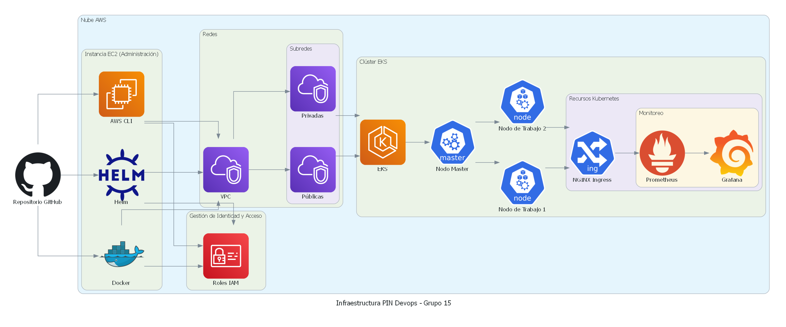

# Trabajo PIN Final MundosE 2402 - Grupo 15

 Este trabajo lo pensamos con capas, donde nos centramos en la config de una instancia EC2 en AWS, y desde allí administrar las demás tareas. Va a continuación un detalle de estas capas:

1 - Capa de Control de Versiones:
    - Repositorio GitHub: Almacena todo el código de infraestructura como código
  	  (IaC) usando Terraform y los charts de Helm.

2 - Capa de Administración:
   Instancia EC2: Servidor de administración que contiene todas las herramientas necesarias:
    - AWS CLI para interactuar con servicios AWS
    - Kubernetes para gestión del cluster
    - Docker para contenedores
    - Terraform para infraestructura como código
    - Helm para gestión de aplicaciones Kubernetes

3 - Capa de Seguridad y Accesos:
    - Gestión de Identidad y Acceso (IAM):
       - Roles IAM para permisos y políticas de acceso

4 -Capa de Red:
    - VPC (Red Virtual Privada)
    - Subredes:
       - Públicas: Para recursos que necesitan acceso a internet
       - Privadas: Para recursos internos
    - Grupos de Seguridad: Reglas de firewall a nivel de instancia

5 - Capa de Kubernetes (EKS):
    - Nodo Master (control plane):
       - Gestiona el estado del cluster
       - Programa los pods
       - Maneja las actualizaciones
    - Nodos de Trabajo:
       - Ejecutan las cargas de trabajo
       - Hospedan los pods

6 - Capa de Aplicaciones y Monitoreo:
   - NGINX Ingress: Controlador de ingreso para tráfico externo
   - Stack de Monitoreo:
       - Prometheus: Recolección de métricas
       - Grafana: Visualización y dashboards

## Desarrollo del proyecto:

1 - Crear y configurar instancia EC2

2 - Configurar instancia y cliente aws

3 - Crear cluster con eksctl

4 - Crear cluster con terraform

5 - Configurar kubectl

6 -Herramientas de monitoreo

